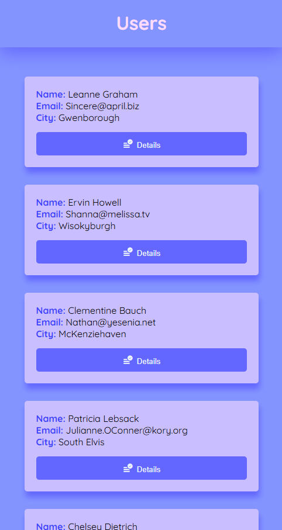
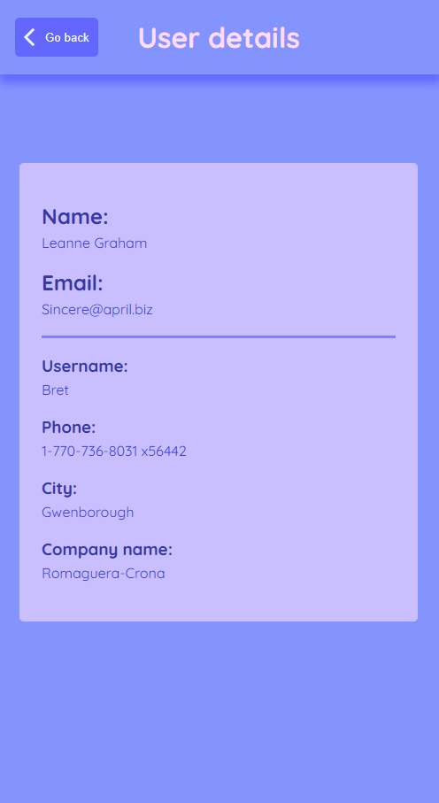

# 👥 User List & Details

An Angular application that displays a list of users retrieved from a public API and allows navigation to a detailed page for each user.

This project was developed during the **Front-end classes at Bosch**, taught by **Marcelo Petri**.

---

## 📖 About

The application consumes the **JSONPlaceholder API** to display user information, including names, email addresses, and cities. Selecting a user opens a dedicated page with additional details through dynamic routing.

---

## ✨ Features

- Display users from a public API
- User details page
- Dynamic routing
- Search users by name
- Loading and error states
- Placeholder profile images
- Previous/Next user navigation
- Custom icons and favicon

---

## 📸 Preview

### User List



### User Details



---

## 🛠 Technologies

- Angular
- TypeScript
- HTML5
- CSS3
- RxJS
- JSONPlaceholder API

---

## 🌐 API Used

### JSONPlaceholder

https://jsonplaceholder.typicode.com/users

---

## 🚀 Running the Project

Clone the repository:

```bash
git clone https://github.com/YOUR_USERNAME/REPOSITORY_NAME.git
```

Install the dependencies:

```bash
npm install
```

Run the application:

```bash
ng serve
```

Open:

```
http://localhost:4200
```

---

## 📚 What I Learned

During this project I practiced:

- Angular routing
- Dynamic routes
- Route parameters
- Services
- HttpClient
- Observables
- Component communication
- Search filtering
- Loading and error handling
- TypeScript interfaces

---

## 👨‍💻 Author

Developed by **Beatriz Heimann**.

Guided activity developed during the **Front-end classes at Bosch**.

# 📖 Detailed Documentation

<details>
<summary>Click to expand the implementation details</summary>

## Dynamic Routing

The application uses Angular's dynamic routing feature through the route:

```
/details/:id
```

Example:

```
http://localhost:4200/details/2
```

The `:id` parameter allows the application to identify which user should be displayed on the details page.

---

## Using paramMap

Angular's `paramMap` provides access to route parameters.

In the `UserDetailComponent`, the `id` parameter is retrieved from the URL and used to request the selected user's information.

```ts
ngOnInit() {
  const id = this.activatedRoute.snapshot.paramMap.get('id');

  if (id) {
    this.userService.userById(Number(id)).subscribe(user => {
      this.user = user;
      this.isLoading = false;
      this.cdr.detectChanges();
    });
  }
}
```

---

## Using Observables

Angular's `HttpClient` returns **Observables**, which represent asynchronous streams of data.

The requests are only executed when `subscribe()` is called.

Example:

```ts
getUsers(): Observable<User[]> {
    return this.http.get<User[]>(this.apiUrl);
}
```

When another component subscribes to this Observable, the HTTP request is executed and the received users are returned.

```ts
this.userService.getUsers().subscribe(users => {
    this.users = users;
});
```

The same approach is used to retrieve a single user by their ID.

---

## Final Thoughts

This project strengthened my understanding of Angular fundamentals, especially routing, services, Observables, HTTP requests, and component organization.

Building the application from scratch also gave me practical experience with TypeScript, reusable components, and creating a more polished user interface.
</details>
